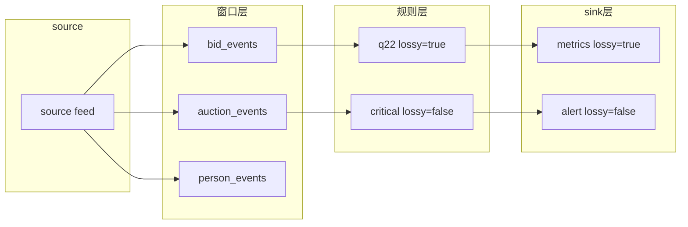

# 可靠性感知的背压与驱逐设计（lossy 分级）

> **状态：Proposed（方案，未实现）**
>
> 2026-08-21 · 前置：[window-log-eviction-design.md](window-log-eviction-design.md)
> （消费感知驱逐 + ack floor）、[window-actor-pull-model.md](window-actor-pull-model.md)
> （pull 模型规则任务）、[window-memory-control.md](window-memory-control.md)（旧版两层驱逐）

---

## 1. 背景与问题

引擎是 `source → 窗口 → 规则 → sink` 的分层数据流。两类「慢」会沿数据流反向传导，把
整个系统拖垮：

1. **慢规则**：规则任务消费窗口慢 → 窗口堆积 → 上游 feed 慢 / 驱逐丢数据。
2. **慢 sink**：后端接收慢 → 规则 emit 阻塞 → 规则慢 → 窗口堆积 → 上游慢。

历史上这两种「慢」都用**全局一刀切**的方式处理，要么「全背压」要么「全丢」，
都有副作用：

- **全背压**（`window-log-eviction-design.md` 的 ack floor）：一个慢规则通过
  `min_acked` 钉住窗口驱逐地板，**拖垮所有窗口**（q22 曾把 `bid_events` 撑到
  2.3GB）。
- **全丢**（本次实验中的「取消 `consumed`」）：时间驱逐不认 ack，慢规则落后就
  `gap` 跳过——**所有规则都丢**，包括那些本不该丢的。

结论：需要**按数据流的每一层声明「这条数据能不能丢」**，慢的组件只影响自己那条
路径，不拖垮别人。

---

## 2. 核心方案：静态 lossy 分级

给规则和 sink 各加一个**静态**配置 `lossy`（可丢 / 不可丢），行为二分：

| 标记 | 行为 |
|---|---|
| `lossy = true`（可丢） | 慢就丢：规则落后窗口驱逐、sink 满 drop。**不背压、吞吐不降** |
| `lossy = false`（不可丢，默认） | 慢就背压：窗口满暂停 append、sink 满 await。**不丢数据、吞吐让路** |

**只做静态分级，不做动态阈值/丢失率切换**——保持配置简单、行为可预测（阈值切换
的状态机、滑动窗口、滞后等复杂度不引入，除非未来有明确需求）。

---

## 3. 关键设计

### 3.1 ack floor 只由「不可丢规则」决定（核心）

现在 `WindowProgress::min_acked` 取**所有**消费者的最小 ack，是「慢规则拖垮驱逐」
的根源。改为只统计 `lossy = false` 的规则：

```rust
// progress.rs
pub fn min_acked(&self) -> u64 {
    // 只遍历 lossy=false 的 slot；可丢规则落后由 gap 跳过，不参与地板
    self.slots.iter()
        .filter(|s| !s.lossy)
        .filter_map(|w| w.upgrade())
        .map(|slot| slot.load(Ordering::Acquire))
        .min()
        .unwrap_or(u64::MAX) // 无不可丢消费者 → 可自由按时间驱逐
}
```

`evict_expired` 继续用这个 floor 做「事件时间过期 && 已被不可丢消费者 ack」驱逐。

由此，三种历史行为被统一成一种：

| 窗口的消费者构成 | 等价于 |
|---|---|
| 全是可丢规则 | 「取消 consumed」：驱逐不认 ack，落后就丢 |
| 全是不丢规则 | 「保留 consumed」：驱逐 respect ack |
| 混合 | 可丢的丢自己、不可丢的保数据，互不拖累 |

可丢规则落后时，`read_since` / `read_since_with_shard` 的既有 `gap_detected` 机制
会把它从 `oldest_seq` 继续、跳过被驱逐的批次（丢数据），无需新增逻辑。

### 3.2 per-window 背压（不可丢规则的兜底）

不可丢规则慢时，窗口堆积；必须靠 **per-window 背压**保证窗口有界，否则 OOM。

当前背压是全局的（`actor.rs::commit_append` 检查 `gate.current_bytes >
max_total_bytes`，`max_total_bytes = 20GB`），太粗。改为**每个窗口到自己的
`max_window_bytes` 就刹自己的车**：

```
窗口内存 > max_window_bytes
  ├─ 能安全驱逐（最老 batch 已被不可丢消费者 ack）→ 驱逐
  └─ 不能驱逐 → 暂停该窗口的 append，等 evictor 唤醒
```

这样不可丢规则慢时，数据停在**上游 client**（不丢、也不撑爆窗口），其它窗口照常。

### 3.3 sink 的 drop / await

`sink/dispatch.rs` 的 `SinkRuntime::send_record` 按 `lossy` 决定满时行为：

- `lossy = true`：发送队列满时 **drop**（或采样），`dispatch` 立即返回，不阻塞规则。
- `lossy = false`：发送队列满时 **await**，把背压传导回产生该 sink 的规则。

同时修掉 `dispatch` 里 `for sink in &route.sinks { send_record().await }` 的串行
阻塞：同一 yield-target 路由到多个 sink 时，一个慢 sink 不应阻塞同批的快 sink
（并发 send，或每个 sink 独立投递队列）。

---

## 4. 数据流与背压传导



**原则：背压只沿同一条数据流路径反向传导，绝不跨路径。**

- `R1`（可丢）慢 → `W1` 驱逐它的未读数据（它丢自己）→ 不拖 `R2` / `W2`。
- `R2`（不可丢）慢 → `W2` 到 `max_window_bytes` 背压 → 只拖慢 `W2` 的 source。
- `S1`（可丢）慢 → drop → 不拖 `R1`。
- `S2`（不可丢）慢 → await → 只拖 `R2`。

---

## 5. 配置语法

### 5.1 规则（WFL）

```wfl
rule q22_asof_person {
    lossy = true          // 可丢：慢时允许窗口驱逐未读数据
    events { b : bid_events }
    ...
}

rule critical_alert {
    lossy = false         // 不可丢（默认）：慢时背压
    ...
}
```

### 5.2 sink（TOML）

```toml
[[business]]
patterns = ["metrics_*"]
lossy = true             # 指标类：慢后端可丢

[[business]]
patterns = ["alert_*"]
lossy = false            # 告警类：慢后端背压
```

默认 `lossy = false`（不可丢），保证未显式声明的规则/sink 走最安全的背压路径。

---

## 6. 组合语义

规则与 sink 的 `lossy` 独立生效（数据流上的两个不同位置）：

| 规则 | sink | 行为 |
|---|---|---|
| 不可丢 | 不可丢 | 全链路背压（最严格） |
| 不可丢 | 可丢 | 规则层不丢；产出后 sink 可丢 alert |
| 可丢 | 不可丢 | 规则层可丢（窗口驱逐）；产出后 sink 必须送到 |
| 可丢 | 可丢 | 全链路可丢（最宽松） |

---

## 7. 改动清单

| 位置 | 改动 |
|---|---|
| 配置解析 | WFL 规则 + sink TOML 增加 `lossy` 字段（默认 `false`） |
| `window/progress.rs` | slot 带 `lossy` 标记；`min_acked` 只统计非可丢 slot |
| `window/fanout.rs` / `rule_task.rs` | 规则注册 slot 时传入 `lossy` |
| `window/eviction.rs` | `evict_expired` 的 floor 改走 `min_acked_among_non_lossy` |
| `window/actor.rs` | 背压从「全局 20GB」改为「per-window `max_window_bytes`」 |
| `sink/runtime.rs` + `sink/dispatch.rs` | 按 `lossy` 决定 drop/await；修串行 dispatch |

---

## 8. 测试用例设计

按「单元 → 配置 → 行为 → 集成」四层覆盖，每层锁定一个不变量。

### 8.1 单元：ack floor 分级

| 用例 | 场景 | 断言 |
|---|---|---|
| `min_acked_ignores_lossy_slots` | 两消费者：lossy(ack=0) + non-lossy(ack=10) | `min_acked == 10` |
| `min_acked_all_lossy_is_max` | 全是 lossy 消费者 | `min_acked == u64::MAX`（可自由按时间驱逐） |
| `min_acked_all_non_lossy` | 全是 non-lossy 消费者 | 等于最小 ack（保持现有行为） |
| `min_acked_lossy_slot_release` | lossy slot 释放/丢弃后 | 不影响 floor |

### 8.2 单元：驱逐按「非可丢 floor」

| 用例 | 场景 | 断言 |
|---|---|---|
| `evict_respects_non_lossy_floor` | 可丢规则落后 + 不可丢规则 ack 高 | 驱逐停在不可丢 floor，可丢规则的未读批被驱逐 |
| `evict_all_lossy_ignores_floor` | 窗口全是可丢规则 | 驱逐不管 ack（等价「取消 consumed」） |
| `evict_no_non_lossy_full_evict` | 无不可丢消费者 | `min_acked=MAX`，按事件时间全驱逐 |

### 8.3 单元：可丢规则 gap 跳过

| 用例 | 场景 | 断言 |
|---|---|---|
| `lossy_rule_gap_skips` | 可丢规则 cursor 落后，窗口已驱逐 | `read_since_with_shard` 返回 `gap_detected=true`，从 `oldest_seq` 继续 |
| `non_lossy_rule_never_gaps` | 不可丢规则落后 | 窗口不驱逐其未读批，无 gap |

### 8.4 配置解析

| 用例 | 场景 | 断言 |
|---|---|---|
| `wfl_lossy_parse` | 规则 `lossy = true / false / 缺省` | 分别解析为 `true / false / false` |
| `sink_lossy_parse` | sink TOML `lossy = true / false / 缺省` | 分别解析为 `true / false / false` |

### 8.5 sink 行为

| 用例 | 场景 | 断言 |
|---|---|---|
| `lossy_sink_drops_when_full` | 可丢 sink 队列满 | `dispatch` 立即返回（drop），不阻塞规则 |
| `non_lossy_sink_awaits_when_full` | 不可丢 sink 队列满 | `await`（背压），不丢 alert |
| `multi_sink_no_head_of_line_block` | 同一 yield-target 路由多个 sink，一慢一快 | 慢 sink 不阻塞快 sink |

### 8.6 per-window 背压

| 用例 | 场景 | 断言 |
|---|---|---|
| `non_lossy_backpressure_on_full` | 不可丢规则慢，窗口超 `max_window_bytes` 且最老批未 ack | 暂停 append（背压），不驱逐、不 OOM |
| `backpressure_resumes_after_ack` | 规则 ack 推进后 | 驱逐释放空间，恢复 append |
| `lossy_window_no_backpressure` | 窗口全是可丢规则 | 不背压，靠时间驱逐有界 |

### 8.7 集成：隔离性（核心验收）

| 用例 | 场景 | 断言 |
|---|---|---|
| `slow_lossy_rule_does_not_starve_non_lossy` | 同一窗口两个规则：lossy 慢 + non-lossy 正常 | non-lossy emit 完整；lossy 有 gap、丢自己的数据 |
| `slow_lossy_sink_isolated` | 两个 sink：lossy 慢 + non-lossy 正常 | lossy sink drop；non-lossy 规则/emit 不受影响 |
| `slow_non_lossy_rule_backpressures_only_own_window` | 不可丢规则慢 | 只拖慢它自己窗口的 append，其它窗口照常 |

> 集成验收的关键观察指标：`cursor_gap_total`（可丢规则丢数据）、`memory_evicted_total`
> （应保持 0）、`acked_lag`（不可丢规则的背压水位）。

---

## 9. 关联

- [window-log-eviction-design.md](window-log-eviction-design.md) —— ack floor 的
  现状与「消费感知驱逐」的来龙去脉
- [window-actor-pull-model.md](window-actor-pull-model.md) —— pull 规则任务的
  `gap_detected` 跳过语义
- [window-memory-control.md](window-memory-control.md) —— 旧版两层驱逐（本文
  的 per-window 背压是其细化）
